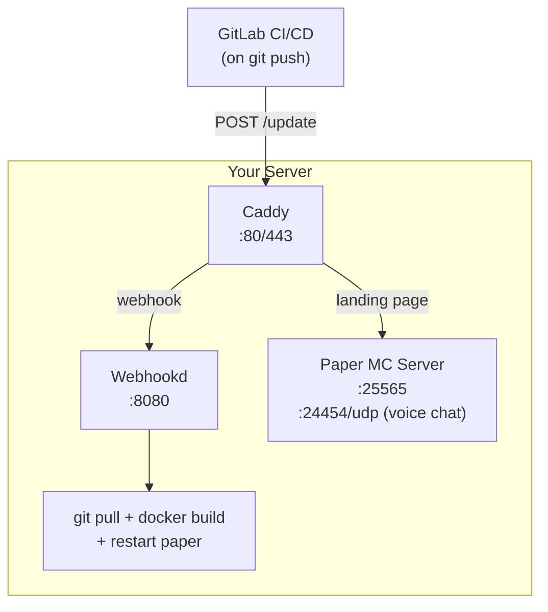

# Minecraft Server GitOps Blueprint

A GitOps-driven Minecraft server setup using Docker, with automated deployments via webhooks. Push changes to your
repository, and your server automatically updates itself.

## Target Audience

This blueprint is for:

- Homelab enthusiasts who want a maintainable Minecraft server
- Developers comfortable with Docker and Git
- Anyone looking to learn GitOps principles with a practical project

**This guide assumes basic familiarity with Docker, Git, and command-line operations.** It won't cover Docker
installation or Git fundamentals.

## Requirements

- **Docker & Docker Compose** - For running the server stack
- **Git with LFS support** - For version control (LFS handles large binary files)
- **A domain name** (optional) - For HTTPS and clean URLs; can be skipped by using IP directly
- **A GitLab account** - For hosting the repository and CI/CD (GitHub works too with modifications)

## Architecture Overview



## First-Time Setup

### 1. Create Your Repository

Create a new GitLab repository for your server. You can fork this blueprint or create a fresh repo and copy the files.

### 2. Install Git LFS

Plugin JAR files can be large. Git LFS prevents your repository from bloating:

```bash
# Install Git LFS (if not already installed)
# macOS
brew install git-lfs

# Ubuntu/Debian
sudo apt install git-lfs

# Initialize LFS in your repo
git lfs install
git lfs track "*.jar"
git lfs track "*.zip"
```

The `.gitattributes` file is already configured to track these extensions.

### 3. Customize the Template

Search for `CUSTOMIZE` comments throughout the codebase to find everything that needs adjustment:

```bash
grep -r "CUSTOMIZE" --include="*.yml" --include="*.sh" --include="Caddyfile" --include="Dockerfile"
```

Key files to customize:

| File                         | What to change                                               |
|------------------------------|--------------------------------------------------------------|
| `docker-compose.yml`         | Domain name, Discord credentials, platform (arm64 if needed) |
| `caddy/Caddyfile`            | Domain, basic auth credentials                               |
| `update.sh`                  | Domain, basic auth credentials                               |
| `webhookd/scripts/update.sh` | Git remote URL                                               |
| `paper/Dockerfile`           | Paper version URL, RCON password                             |
| `paper/server.properties`    | Server name, RCON password, game settings                    |

### 4. Choose Your Server Software

This blueprint uses [PaperMC](https://papermc.io/), recommended for vanilla-style servers with performance improvements.

To update the Paper version:

1. Go to https://papermc.io/downloads/paper
2. Copy the download URL for your desired version
3. Update `paper_download_url` in `paper/Dockerfile`

**Want a different server?** Replace the download stage in the Dockerfile. The rest of the setup (plugins, configs) may
need adjustment based on your choice.

### 5. Add Your Plugins

Download plugins from trusted sources and add them to `paper/plugins/`:

**Recommended sources:**

- [Modrinth](https://modrinth.com/plugins) - Open source focused
- [SpigotMC](https://www.spigotmc.org/resources/) - Largest plugin repository
- [Hangar](https://hangar.papermc.io/) - PaperMC's official plugin repo

```bash
# Example: Adding a new plugin
cd paper/plugins/
curl -L -o MyPlugin-1.0.jar "https://example.com/plugin-download-url"
git add MyPlugin-1.0.jar
```

### 6. Configure Players (Whitelist)

Edit `paper/players.yml` to manage your whitelist:

```yaml
players:
  - name: "YourUsername"
    uuid: "xxxxxxxx-xxxx-xxxx-xxxx-xxxxxxxxxxxx"  # Get from https://mcuuid.net/
    keepInventoryEnabled: false  # Per-player keepInventory (requires plugin)
```

The `manage_players.py` script automatically generates `whitelist.json` during build.

### 7. Test Locally

Before deploying, verify everything works:

```bash
# Build and start the server
docker compose up --build

# In another terminal, check logs
docker compose logs -f paper

# Test connecting with your Minecraft client to localhost:25565
```

Press `Ctrl+C` to stop when done testing.

### 8. Push to Repository

```bash
git add .
git commit -m "Initial server configuration"
git push origin main
```

## Server Setup (Remote Host)

### 1. Initial Clone

SSH into your server and clone the repository:

```bash
cd /opt  # or your preferred location
git clone https://gitlab.com/your-user/your-server.git minecraft
cd minecraft
```

### 2. Configure Secrets

Create your environment-specific configuration:

```bash
# Set up Discord credentials (don't commit these!)
export DISCORD_BOT_TOKEN="your-actual-token"
export DISCORD_CHANNEL_ID="your-channel-id"
```

Or create a `.env` file (already in `.gitignore`):

```bash
DISCORD_BOT_TOKEN=your-actual-token
DISCORD_CHANNEL_ID=your-channel-id
```

### 3. Initial Build & Start

```bash
# Build all containers and start in background
docker compose up -d --build

# Verify all services are running
docker compose ps

# Check logs for any issues
docker compose logs -f
```

**Important:** The first build may take several minutes as it downloads Paper and bootstraps the server.

### 4. Configure Caddy Authentication

Generate a password hash for the webhook endpoint:

```bash
docker run --rm caddy:2-alpine caddy hash-password --plaintext 'your-secure-password'
```

Update `caddy/Caddyfile` with your username and the generated hash, then:

```bash
docker compose up -d --build caddy
```

### 5. Set Up CI/CD

In your GitLab repository, add a `.gitlab-ci.yml`:

```yaml
stages:
  - deploy

deploy:
  stage: deploy
  script:
    - chmod +x update.sh
    - ./update.sh
  only:
    - main
  environment:
    name: production
```

Configure the `update.sh` script with your webhook credentials to match the Caddy basic auth.

## Adding New Plugins

Once your server is running, here's the workflow for adding plugins:

### 1. Download the Plugin

```bash
cd paper/plugins/
curl -L -o PluginName-1.0.jar "https://download-url"
```

### 2. Spin Up Locally to Generate Configs

Plugins generate their default config files on first run. Start the server and keep it running:

```bash
# Start the server locally (in background)
docker compose up -d --build paper

# Watch logs until the server is fully started
docker compose logs -f paper
# Wait for "Done! For help, type "help"" message
```

### 3. Copy Generated Configs (While Running)

With the container still running, copy out the generated config files:

```bash
# List what was generated
docker compose exec paper ls -la /opt/minecraft-server/plugins/PluginName/

# Create local directory for the config
mkdir -p paper/plugins/PluginName

# Copy configs out of the running container
docker compose cp paper:/opt/minecraft-server/plugins/PluginName/config.yml ./paper/plugins/PluginName/
```

Now you can stop the server:

```bash
docker compose down
```

### 4. Adjust Configuration

Edit the copied config files as needed:

```bash
vim paper/plugins/PluginName/config.yml
```

### 5. Commit and Push

```bash
git add paper/plugins/
git commit -m "Add PluginName plugin with configuration"
git push
```

### 6. Let GitOps Do Its Magic

Once pushed, the CI/CD pipeline triggers the webhook, which:

1. Pulls the latest changes
2. Rebuilds the Docker image with the new plugin
3. Notifies players of the impending restart
4. Restarts the server with the new configuration

## Included Plugins

This blueprint comes with several pre-configured plugins:

| Plugin                                                                        | Purpose                   |
|-------------------------------------------------------------------------------|---------------------------|
| [LuckPerms](https://luckperms.net/)                                           | Permission management     |
| [Simple Voice Chat](https://modrinth.com/plugin/simple-voice-chat)            | Proximity voice chat      | 
| [Chunky](https://modrinth.com/plugin/chunky)                                  | World pre-generation      |
| [NoChatReports](https://modrinth.com/plugin/nochatreports-spigot-paper)       | Disable chat reporting    | 
| [ImageFrame](https://modrinth.com/plugin/imageframe)                          | Display images on maps    |
| [Backuper](https://modrinth.com/plugin/backuper)                              | Automated backups         | 
| [BasicDiscordRelay](https://github.com/Jelly-Pudding/minecraft-discord-relay) | Discord chat bridge       | 
| [Keep-Inv-Individual](https://github.com/Logics4/IndividualKeepInventory)     | Per-player keepInventory  |
| [FastGhast](https://modrinth.com/plugin/fastghast)                            | Happy Ghast speed control |

## Maintenance

### Viewing Logs

```bash
# All services
docker compose logs -f

# Just Minecraft server
docker compose logs -f paper

# Just the last 100 lines
docker compose logs --tail 100 paper
```

### Server Console Access

```bash
# Attach to server console (detach with Ctrl+P, Ctrl+Q)
docker attach minecraft-paper-1

# Or use RCON
docker compose exec paper rcon -c /opt/rcon-cli/config.yaml "say Hello!"
```

### Manual Restart

```bash
docker compose restart paper
```

### Backups

Backups are stored in `./data/backups/` (configured via Backuper plugin). Consider setting up off-site backup sync:

```bash
# Example: sync to remote storage
rsync -av ./data/backups/ user@backup-server:/backups/minecraft/
```

### Updating Paper

1. Get new download URL from https://papermc.io/downloads/paper
2. Update `paper_download_url` in `paper/Dockerfile`
3. Commit and push - server updates automatically

## Troubleshooting

### Server won't start

```bash
# Check logs for errors
docker compose logs paper

# Common issues:
# - EULA not accepted (should be automatic)
# - Port already in use
# - Insufficient memory
```

### Webhook not working

```bash
# Check Caddy logs
docker compose logs caddy

# Test webhook manually
curl -X POST https://your-domain/update \
  -u "username:password" \
  -d "gitlab_token=test" \
  -d "commit_message=test" \
  -d "restart_in_seconds=5"
```

### Players can't connect

- Verify port 25565 is open in your firewall
- Check `server.properties` for correct settings
- Ensure whitelist is properly configured

### Voice chat not working

- Port 24454/UDP must be open
- Players need the Simple Voice Chat mod installed

## License

This blueprint is provided as-is. Individual plugins have their own licenses (see the linked sources for details).
